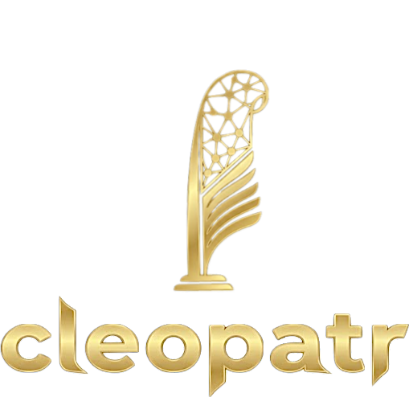
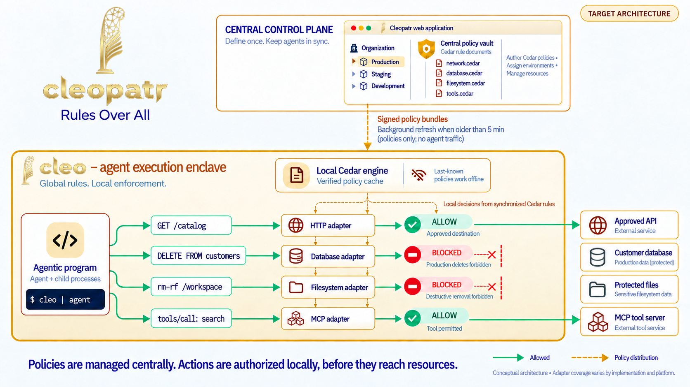
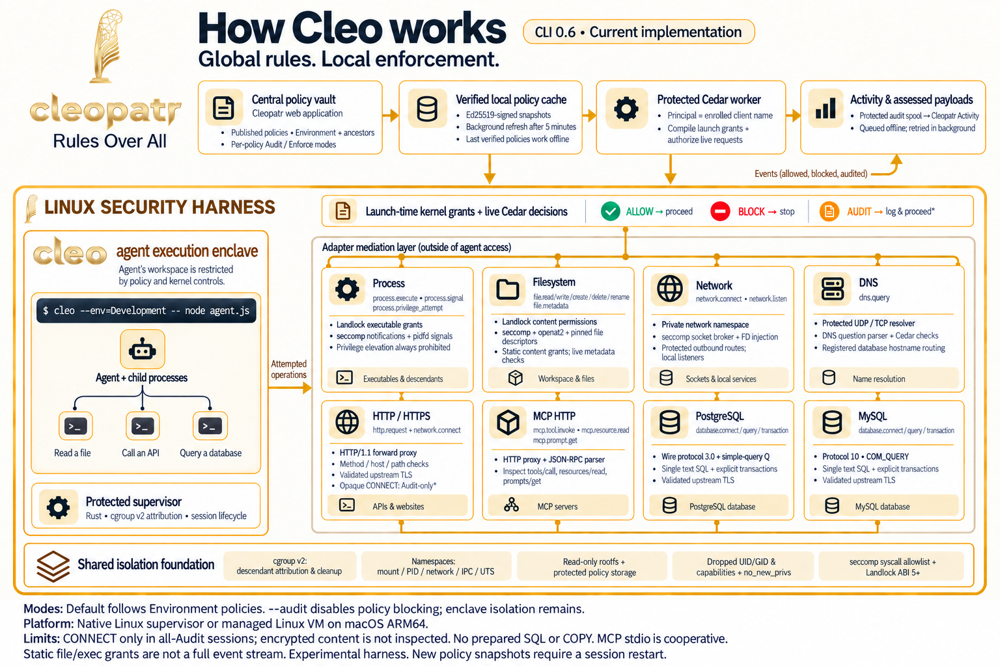

# Cleopatr brand assets

The supplied gold feather and lowercase wordmark are the Cleopatr identity. The PNG files in `public/brand/` are unchanged copies of the original artwork, including their transparency.

| Asset | Source dimensions | Usage |
|---|---|---|
| [Full logo](../public/brand/cleopatr-logo.png) | 509 × 494 | App sidebar, project README, architecture infographic title |
| [Feather icon](../public/brand/cleopatr-feather.png) | 264 × 376 | App header, workspace badge, browser icon, CLI and implementation documentation, infographic brand accents |
| [Cleo wordmark](../public/brand/cleo-logo.png) | 256 × 117 | CLI execution-boundary heading in the architecture infographic |

Keep each image's original proportions, gold colors, and transparent background. Scale to fit rather than stretching, cropping, recoloring, or recreating the lettering. Leave clear space around the artwork. The app presents the logo on its navy sidebar and the compact header feather on a navy tile.

Use descriptive alternative text when a logo identifies Cleopatr. Use empty alternative text when it is decorative beside an existing label. Keep the globe, database, filesystem, and policy icons for their functional meanings.

The CLI build copies the canonical feather into its package and rewrites the README image path so the image ships with the downloadable archive.

## App colors

Gold gradients carry the app's brand emphasis. Primary buttons use a metallic gold fill (`#c39a3d → #f4d984 → #d4ac50`) with dark text. Emphasized text on light surfaces uses deeper gold (`#795018 → #906211 → #785014`) for contrast; text on navy uses a brighter gold gradient. Secondary controls and selected environments use pale gold surfaces. Shared color tokens live in `app/globals.css`.

Preserve neutral body text and the green/red allow, deny, success, and error colors. Keyboard focus uses a gold outline, and gradient text falls back to solid text in forced-color accessibility modes.

## Architecture infographic

The infographic is a conceptual target architecture, not a coverage guarantee. See [implementation coverage](IMPLEMENTATION_STATUS.md) for the current runtime boundaries. Its full logo, two feather icons, and Cleo wordmark are composited directly from the canonical PNGs in `public/brand/`, preserving their artwork, colors, transparency and proportions. Only transparent outer padding is trimmed for placement.

The infographic follows the app's gold gradients, white panels, and navy text, with green allowed operations and red blocked operations. The execution-boundary heading uses the supplied Cleo wordmark; the `cleo | agent` example remains plain command text. Pipe syntax requires the CLI's interactive zsh integration. The [gold-theme edit prompt](assets/cleopatr-gold-theme-prompt.txt) records the palette and preservation requirements.

The [latest logo refresh prompts](assets/cleopatr-logo-refresh-prompt.txt) record the built-in imagegen edits. The logo-free layout is saved as `assets/cleopatr-architecture-layout.png`; run `node scripts/brand-infographic.mjs` from the project root to regenerate the final infographic with the current canonical brand images. This keeps future logo replacements faithful to the source artwork rather than generating new lettering or feather details.

## Cleo CLI adapters infographic

The [Cleo CLI infographic](assets/cleo-cli-adapters.png) describes the implemented CLI 0.6 coverage: process, filesystem, network, DNS, HTTP/HTTPS, MCP HTTP, PostgreSQL and MySQL. It distinguishes launch-time Landlock grants from live seccomp and protocol decisions, and shows the shared isolation foundation, policy cache and activity flow. The footer records the current Audit, HTTPS, SQL and telemetry limits; MCP stdio remains cooperative.

This separate illustration was generated with the built-in image generation tool using the canonical logos as references. The [generation and edit prompts](assets/cleo-cli-adapters-prompt.txt) preserve its content and design brief. Technical details come from [Linux harness](LINUX_HARNESS.md) and [enclave action coverage](ENCLAVE_ACTIONS.md). The earlier target-architecture infographic remains available above.
